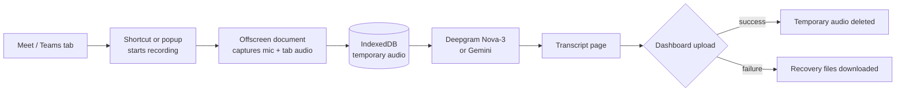

# My Class Recorder

**A lightweight Chrome extension that records Google Meet and Microsoft Teams classes, transcribes them automatically, and makes sure no class is ever lost.**

I teach English online, often in back-to-back lessons with no time in between. My Class Recorder was my first tool for capturing those classes: press a shortcut, teach, and a transcript is waiting when the class ends. It runs entirely in the browser, with no server of its own. It later became the starting point for [TeachAssist AI](https://github.com/amandarpsantos/teachassist-ai).

---

## What it does

- **Records with a shortcut:** **Ctrl+Shift+F** or **Ctrl+Shift+Space** in Google Meet or Microsoft Teams
- **Stops on its own:** detects when the meeting ends and finishes the recording
- **Reminds you to record:** shows a reminder if you're in a meeting and recording is off
- **Handles back-to-back classes:** the next class can start recording immediately while earlier ones are still being transcribed in a queue
- **Transcribes English and Portuguese:** uses Deepgram Nova-3 in multilingual mode, with Brazilian Portuguese keyterm hints so Portuguese isn't mistaken for Spanish
- **Labels speakers:** teacher and student, with the student's name read from the meeting title
- **Offers a backup provider:** switch to Gemini 2.5 Flash in Setup if needed
- **Never loses a class:** audio is saved to the browser before transcription, and if anything fails, the audio and transcript are downloaded automatically as recovery files
- **Reprocesses saved recordings:** re-transcribe recovered audio files from the popup
- **Syncs to a dashboard (optional):** sends finished transcripts to a dashboard endpoint you configure

## How it works

## Problems I solved

**Back-to-back lessons.** Early versions blocked a new recording until the previous transcription finished. I separated capture from processing: the recorder is released as soon as a class ends, and transcriptions run one after another in a queue.

**Mixed-language classes.** My students switch between English and Portuguese, and transcription models often rendered Portuguese as Spanish. Deepgram's multilingual mode plus a list of Brazilian Portuguese key terms fixed most of these errors.

**Never losing audio.** If the internet, the transcription service, or the dashboard fails, the class audio is still safe. Audio is stored in IndexedDB before transcription, recovery files download on failure, and browser storage is cleared only after every backup succeeds.

**Chrome storage limits.** Full transcripts were filling Chrome's storage. The extension now keeps only compact metadata locally and automatically cleans up bulky data, without touching API keys or settings.

The full history is in [CHANGELOG.md](CHANGELOG.md).

## Tech stack

- **Chrome Extensions, Manifest V3:** service worker, offscreen document, `tabCapture`, commands
- **Plain JavaScript**, with no framework and no backend
- **IndexedDB** for temporary audio storage
- **Deepgram API** (Nova-3) and **Gemini API** (2.5 Flash) for transcription

## Getting started

1. Download this repository (**Code → Download ZIP**) and unzip it.
2. In Chrome, open `chrome://extensions` and turn on **Developer mode**.
3. Click **Load unpacked** and select the unzipped folder.
4. In the Setup page, choose **Deepgram** or **Gemini** and paste your API key.
5. Join a Google Meet or Teams class and press **Ctrl+Shift+F** to start recording.

**API keys are never stored in the code.** They are entered in the Setup page and kept in Chrome's local storage on your own computer.

## Privacy

Audio is stored only temporarily in your browser and sent only to the transcription provider you choose. Always ask for your students' consent before recording a class.

## Status

Version 0.5.7. Used for my own classes and succeeded by [TeachAssist AI](https://github.com/amandarpsantos/teachassist-ai). Built through AI-assisted development with ChatGPT and Claude.

---

**Amanda Santos**, educator building AI learning tools · [LinkedIn](https://www.linkedin.com/in/amanda-richelle-peffer-dos-santos-20802b263)
